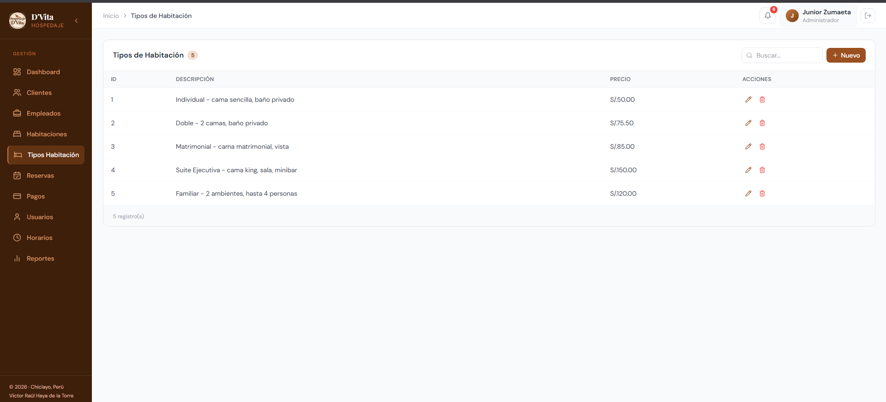

# Manual de Uso — D'Vita System

Sistema de gestión hotelera para **Hospedaje D'Vita**. Incluye módulo de reservas, administración de habitaciones, clientes, empleados, reportes y chatbot inteligente (DViBot).

---

## Índice

1. [Requisitos del Sistema](#1-requisitos-del-sistema)
2. [Instalación Rápida](#2-instalación-rápida)
3. [Estructura del Proyecto](#3-estructura-del-proyecto)
4. [Módulo Público — Landing Page](#4-módulo-público--landing-page)
5. [Acceso al Sistema](#5-acceso-al-sistema)
6. [Módulo de Administración](#6-módulo-de-administración)
   - [Dashboard](#61-dashboard)
   - [Clientes](#62-clientes)
   - [Empleados](#63-empleados)
   - [Habitaciones](#64-habitaciones)
   - [Tipos de Habitación](#65-tipos-de-habitación)
   - [Reservas](#66-reservas)
   - [Pagos](#67-pagos)
   - [Usuarios del Sistema](#68-usuarios-del-sistema)
   - [Horarios](#69-horarios)
   - [Reportes](#610-reportes)
7. [Chatbot DViBot](#7-chatbot-dvibot)
8. [Solución de Problemas](#8-solución-de-problemas)

---

## 1. Requisitos del Sistema

### Hardware
| Componente | Requisito Mínimo |
|------------|------------------|
| Procesador | Dual Core 2.0 GHz |
| RAM | 4 GB |
| Disco | 500 MB libres |

### Software
| Componente | Versión |
|------------|---------|
| Java JDK | 17 o superior |
| Node.js | 18 o superior |
| MySQL | 8.0 o superior |
| Python | 3.10 o superior |
| Navegador | Chrome / Firefox / Edge actualizado |

### Opcional
| Componente | Propósito |
|------------|-----------|
| Ollama | IA local para respuestas inteligentes del chatbot |
| Git | Control de versiones |

---

## 2. Instalación Rápida

### 2.1. Base de datos
```bash
mysql -u root -p < scripD'Vita.sql
```

### 2.2. Backend (Spring Boot)
```bash
cd backend
mvn spring-boot:run
```
Servidor en `http://localhost:8080`.

### 2.3. Frontend (React + Vite)
```bash
cd frontend
npm install
npm run dev
```
Servidor en `http://localhost:5173`.

### 2.4. Chatbot (Python + FastAPI)
```bash
cd chatBot
pip install -r requirements.txt
python main.py
```
Servidor en `http://localhost:8000`.

### 2.5. Orden de arranque
1. MySQL
2. Backend Java (puerto 8080)
3. Chatbot Python (puerto 8000)
4. Frontend React (puerto 5173)

---

## 3. Estructura del Proyecto

```
D'Vita System/
├── backend/               # API REST (Spring Boot)
│   └── src/main/java/com/systemWeb/DVita/
│       ├── Controller/    # Endpoints REST
│       ├── Model/         # Entidades JPA
│       ├── Repository/    # Acceso a datos
│       └── Service/       # Lógica de negocio
├── frontend/              # Aplicación web (React)
│   └── src/
│       ├── components/    # Componentes reutilizables
│       ├── pages/         # Páginas del sistema
│       └── services/      # Llamadas a la API
├── chatBot/               # Chatbot DViBot (Python)
│   ├── main.py            # Servidor FastAPI
│   ├── agent.py           # Orquestador de mensajes
│   ├── handlers.py        # Lógica de menús y reservas
│   └── test_suite/        # Pruebas automatizadas
├── capturas/              # Capturas de pantalla del sistema
├── scripD'Vita.sql        # Script de base de datos
└── .env                   # Variables de entorno
```

---

## 4. Módulo Público — Landing Page

Al ingresar a `http://localhost:5173` se muestra la página principal del hospedaje.

### 4.1. Secciones disponibles
- **Galería de imágenes** — Presentación visual del hospedaje.
- **Habitaciones** — Muestra los tipos de habitación disponibles (Estándar S/.60, Suite Deluxe S/.120, Familiar S/.180) con precios y servicios incluidos.
- **Servicios** — Desayuno incluido, seguridad 24/7, estacionamiento privado, WiFi gratuito.
- **Contacto** — Teléfono, correo electrónico, dirección y formulario de contacto.

### 4.2. Reserva desde la Landing Page
1. Haz clic en el botón **"Reservar ahora"** o en el botón flotante.
2. **Paso 1:** Selecciona el tipo de habitación deseado.
3. **Paso 2:** Completa tus datos personales (nombres, DNI, correo, teléfono).
4. **Paso 3:** Selecciona las fechas de ingreso y salida.
5. Confirma la reserva — se guardará en el sistema y quedará como **Pendiente**.

### 4.3. Chatbot DViBot
En la esquina inferior derecha aparece el ícono del chatbot. Haz clic para abrirlo y consultar:
- Disponibilidad de habitaciones
- Precios y servicios
- Información de contacto
- Crear o consultar reservas

Escribe `menu` en cualquier momento para ver las opciones disponibles.

---

## 5. Acceso al Sistema

### 5.1. Inicio de sesión
Haz clic en **"Iniciar Sesión"** desde la Landing Page o ve a `http://localhost:5173/login`.


Ingresa tu **usuario** y **contraseña** proporcionados por el administrador del sistema.

### 5.2. Recuperación
Si olvidaste tus credenciales, contacta al administrador del sistema para restablecer tu cuenta.

---

## 6. Módulo de Administración

Una vez autenticado, accedes al panel de administración con el menú lateral (Sidebar) que contiene los siguientes módulos:

### 6.1. Dashboard


Panel principal con resumen ejecutivo:
- **Indicadores (KPIs):** Reservas activas, habitaciones disponibles, clientes registrados, ingresos del mes.
- **Check-in / Check-out:** Conteo de ingresos y salidas del día.
- **Reservas Recientes:** Tabla con las últimas reservas registradas.
- **Estado de Habitaciones:** Mapa visual de ocupación por habitación.
- **Ocupación:** Resumen de ocupación por tipo de habitación.

### 6.2. Clientes


Gestión de clientes del hospedaje.

**Acciones:**
- **Registrar cliente:** Ingresa nombre, apellidos, DNI (8 dígitos), teléfono (9 dígitos), correo electrónico.
- **Editar cliente:** Modifica los datos de un cliente existente.
- **Eliminar cliente:** Elimina un cliente del sistema.
- **Buscar por DNI:** Localiza clientes por su número de documento.

**Validaciones:**
- DNI: exactamente 8 dígitos numéricos.
- Teléfono: exactamente 9 dígitos numéricos.
- Campos obligatorios marcados con *.

### 6.3. Empleados


Administración del personal del hospedaje.

**Acciones:**
- **Registrar empleado:** Nombre, apellidos, DNI (8 dígitos), teléfono (9 dígitos).
- **Editar / Eliminar empleado.**

> Los empleados registrados pueden asignarse como usuarios del sistema o como recepcionistas.

### 6.4. Habitaciones


Administración de las habitaciones del hospedaje.

**Acciones:**
- **Crear habitación:** Selecciona el tipo de habitación y asigna un número.
- **Editar / Eliminar habitación.**
- **Cambiar estado:** Haz clic en el botón de estado para alternar entre **Disponible**, **Ocupada** y **Mantenimiento**.

### 6.5. Tipos de Habitación



Define las categorías de habitaciones disponibles.

**Campos:**
- **Descripción:** Nombre del tipo (ej: "Suite Deluxe", "Habitación Familiar").
- **Precio:** Tarifa por noche (debe ser mayor a 0).

### 6.6. Reservas


Gestión completa de reservas. Incluye:

**Creación de reserva:**
1. Busca al cliente por DNI.
2. El sistema consulta automáticamente la **API RENIEC** para autocompletar datos del cliente.
3. Si el cliente no existe, se registra automáticamente.
4. Selecciona fechas de ingreso y salida.
5. Elige tipo de habitación y habitación específica.
6. Confirma la reserva.

**Acciones sobre reservas existentes:**
- **Check-in:** Marca al huésped como ingresado.
- **Check-out:** Marca la salida del huésped.
- **Cancelar:** Cancela la reserva.
- **Editar / Eliminar.**

**Estados de reserva:**
- `PENDIENTE` — Sin confirmar.
- `CONFIRMADA` — Confirmada por el recepcionista.
- `COMPLETADA` — Huésped ya hospedado y finalizado.
- `CANCELADA` — Reserva cancelada.

### 6.7. Pagos


Registro de pagos asociados a las reservas.

**Campos:**
- **Reserva:** Selecciona la reserva a la que pertenece el pago.
- **Monto:** Importe del pago (debe ser mayor a 0).
- **Fecha de pago:** Fecha en que se realizó.
- **Método de pago:** Selecciona entre:
  - Efectivo
  - Tarjeta de Crédito
  - Tarjeta de Débito
  - Transferencia Bancaria
  - Yape
  - Plin

### 6.8. Usuarios del Sistema


Gestión de cuentas de usuario para acceder al sistema.

**Campos:**
- **Empleado asociado:** Selecciona un empleado registrado.
- **Nombre de usuario:** Nombre para iniciar sesión.
- **Contraseña:** Mínimo 8 caracteres.

### 6.9. Horarios

Gestión de horarios y turnos del personal.

**Campos:**
- **Recepcionista:** Selecciona el empleado.
- **Fecha:** Día del turno.
- **Hora inicio / Hora fin.**
- **Tipo de turno:**
  - Mañana (06:00 - 14:00)
  - Tarde (14:00 - 22:00)
  - Noche (22:00 - 06:00)
  - Personalizado
- **Estado del turno:**
  - Programado
  - En curso
  - Completado
  - Ausente

**Filtros disponibles:**
- Por recepcionista.
- Por rango de fechas.
- Turnos "en curso".

### 6.10. Reportes


Panel de análisis y estadísticas del negocio.

**Indicadores:**
- Ingresos del mes actual.
- Ingresos acumulados totales.
- Porcentaje de ocupación actual.
- Total de reservas registradas.

**Gráficos:**
- **Ingresos mensuales:** Gráfico de barras con ingresos de los últimos 6 meses.
- **Reservas por estado:** Distribución de reservas (Confirmadas, Completadas, Pendientes, Canceladas).
- **Métodos de pago:** Porcentaje de uso por método con barras de progreso.
- **Ocupación por tipo de habitación:** Ocupación actual por cada categoría.

---

## 7. Chatbot DViBot

El asistente virtual **DViBot** está disponible tanto en la Landing Page como en el panel de administración.

### 7.1. Funcionalidades
- Consultar disponibilidad de habitaciones.
- Ver precios y servicios del hospedaje.
- Crear, cancelar y consultar reservas.
- Obtener información de contacto y ubicación.
- Navegación por menús interactivos.

### 7.2. Comandos útiles
| Comando | Acción |
|---------|--------|
| `menu` | Muestra el menú principal |
| `reservar` | Inicia el proceso de reserva |
| `habitaciones` | Consulta tipos y precios |
| `contacto` | Muestra información de contacto |

### 7.3. Probar desde terminal
```bash
curl -X POST http://localhost:8000/chat \
  -H "Content-Type: application/json" \
  -d '{"message": "menu", "session_id": "test1"}'
```

### 7.4. Ejecutar pruebas automatizadas
```bash
cd chatBot
python test_suite/test_runner.py
```
Genera un reporte en `chatBot/test_suite/reporte_*.md`.

---

## 8. Solución de Problemas

### 8.1. El frontend no se conecta al backend
- Verifica que el backend esté corriendo en `http://localhost:8080`.
- Revisa el archivo `.env` en la raíz del proyecto con las variables correctas.

### 8.2. Error de autenticación
- Asegúrate de que el usuario existe en la tabla `Usuarios`.
- La contraseña debe tener al menos 8 caracteres.

### 8.3. El chatbot no responde
- Verifica que el servidor Python esté en `http://localhost:8000`.
- Si no usas Ollama, el chatbot funciona con respuestas predefinidas.

### 8.4. La API RENIEC no funciona
- El sistema tiene un modo de fallback: si la API externa no responde, puedes ingresar los datos del cliente manualmente.

### 8.5. Error de base de datos
- Ejecuta nuevamente el script `scripD'Vita.sql` para restaurar la base de datos.
- Verifica credenciales en el archivo `.env`.

---

## Notas Finales

- **Sistema desarrollado por:**
  - Marcelo Alarcón
  - Jair Otero
  - Oscar Santamaría
  - Junior Zumaeta

- **Stack tecnológico:** React + TypeScript + Vite (Frontend) · Java + Spring Boot (Backend) · MySQL (Base de datos) · Python + FastAPI (Chatbot)

- **Repositorio:** [github.com/JuFer007/DVIta_System](https://github.com/JuFer007/DVIta_System)
