

  
    
  
<strong>Sistema de gestión hotelera con reservas, administración de habitaciones, clientes, empleados, reportes y chatbot inteligente</strong>

  
  
  
  
  
  
  
  

---

## Módulos

### Landing Page
Página principal con presentación del hospedaje, servicios y acceso al sistema.

| | |
|---|---|
| 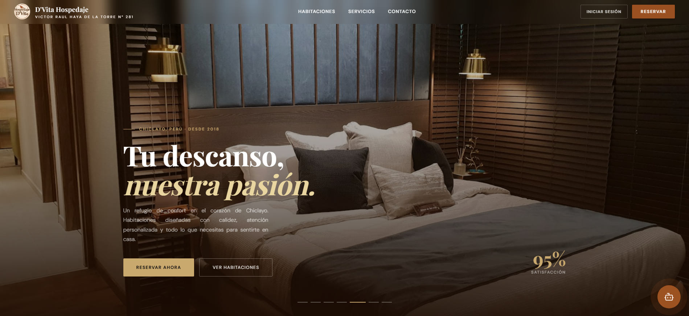 | 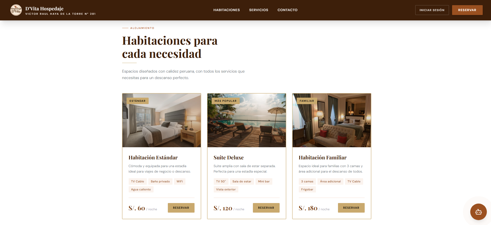 |
| 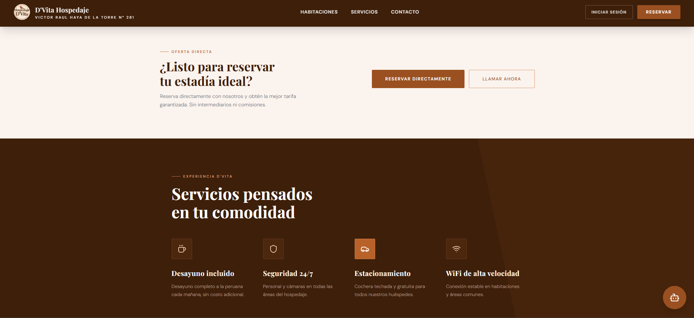 | 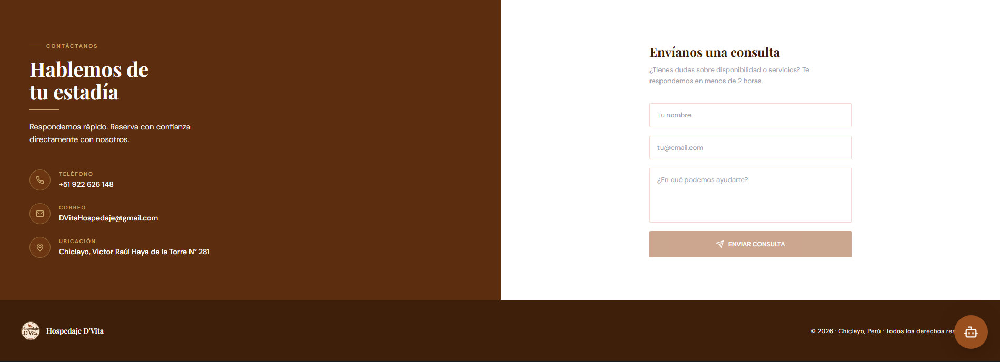 |

### Autenticación
Inicio de sesión para recepcionistas y administradores.

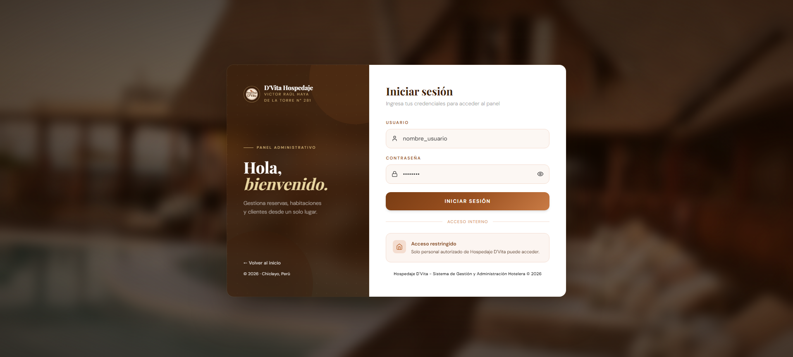 

### Dashboard
Panel principal con resumen de ocupación, reservas activas e ingresos.

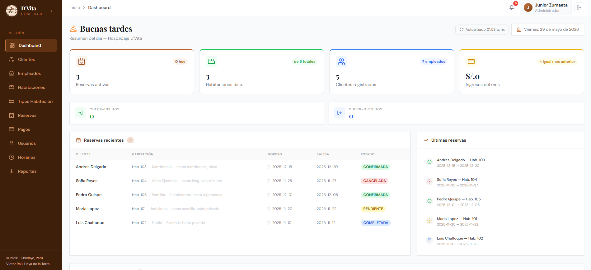 

### Gestión de Reservas
Creación, cancelación y consulta de reservas con wizard guiado.

| | |
|---|---|
| 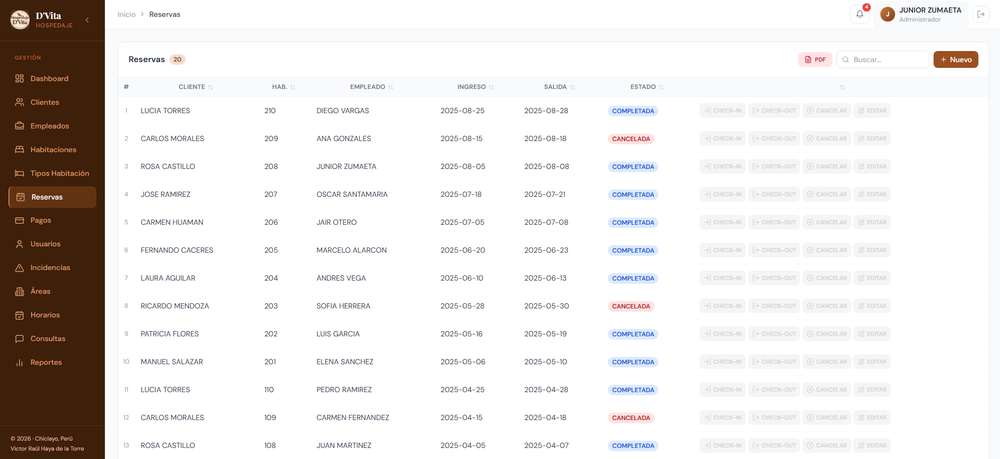 | 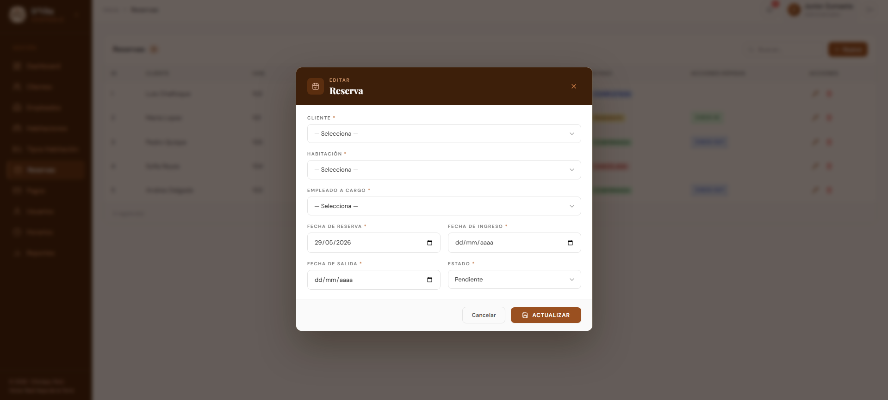 |

### Gestión de Habitaciones
Administración de habitaciones, tipos y precios.

| | |
|---|---|
| 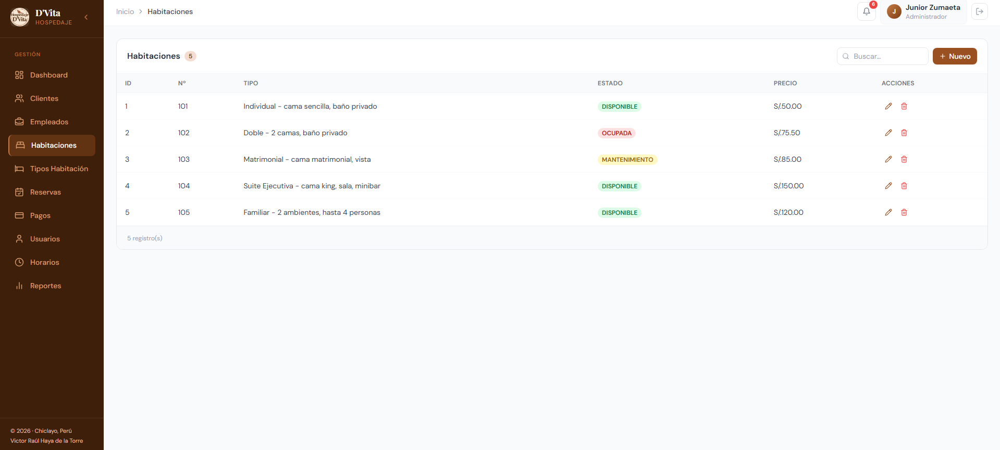 | 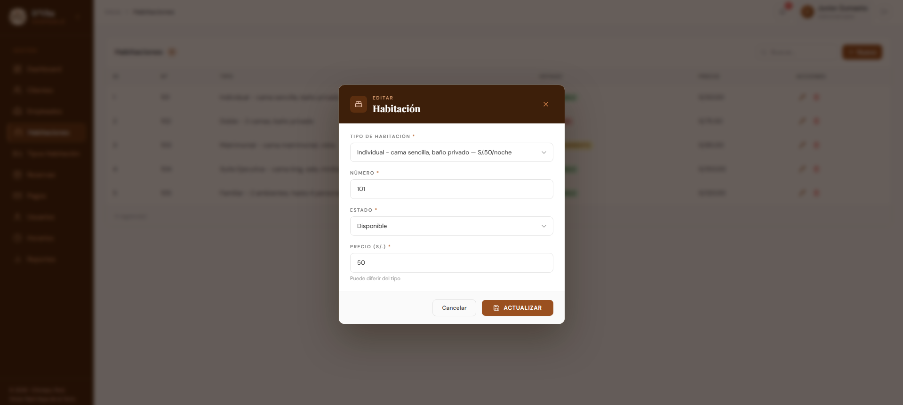 |

### Gestión de Clientes
Registro y búsqueda de clientes con integración RENIEC.

 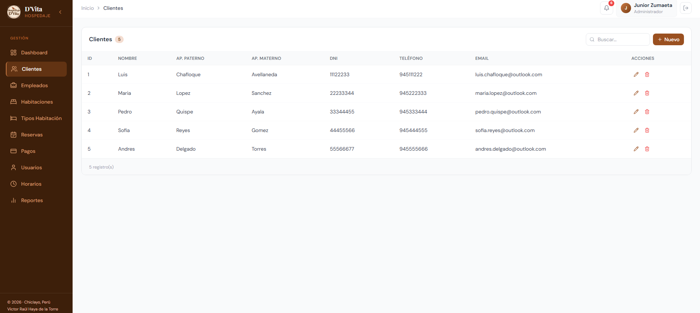 

### Gestión de Empleados
Administración del personal del hospedaje.

 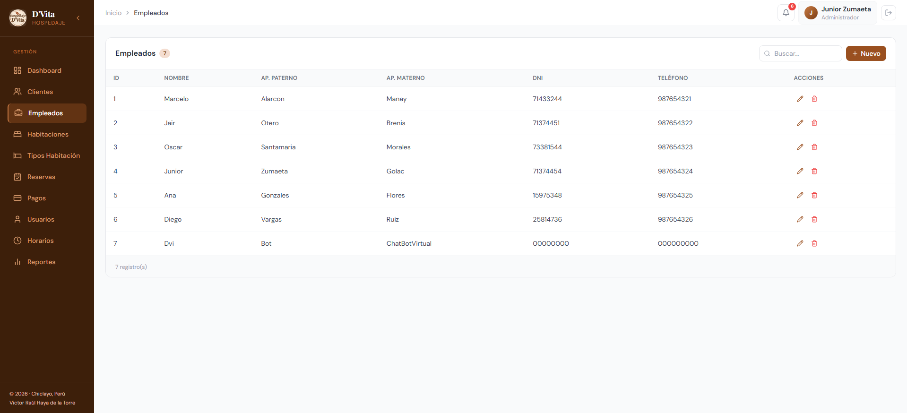

### Usuarios del Sistema
Gestión de usuarios, roles y permisos.

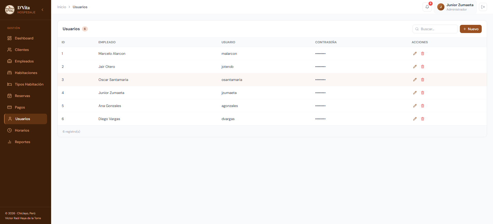 

### Pagos
Registro y consulta de pagos por reserva.

| | |
|---|---|
| 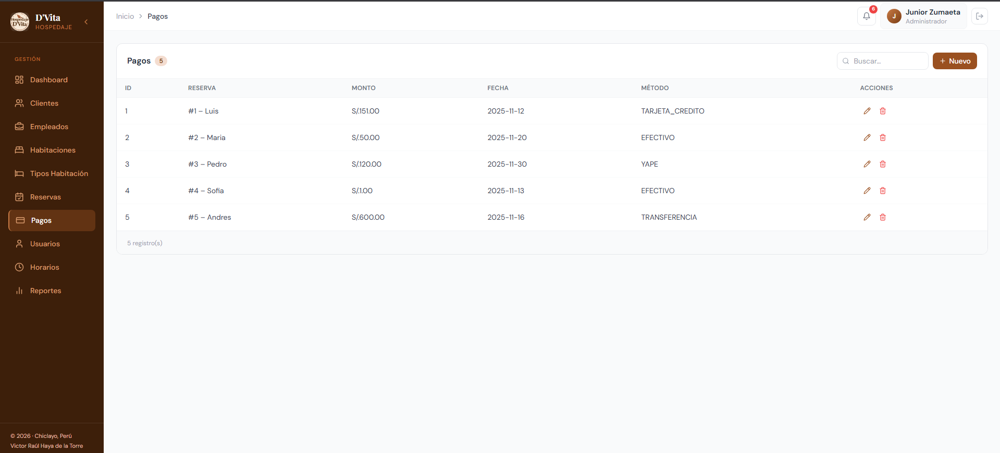 | 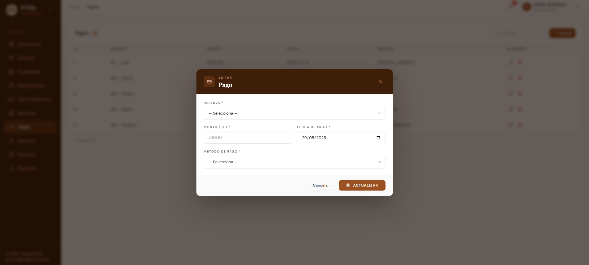 |

### Reportes
Reportes de ocupación, ingresos y estadísticas.

| | |
|---|---|
| 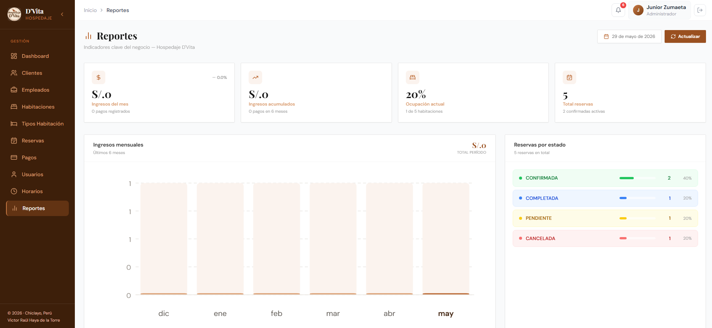 | 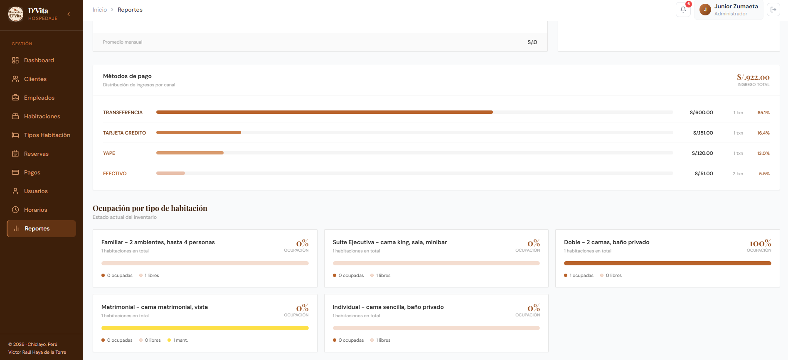 |

## Chatbot DViBot

Asistente virtual integrado en el frontend que permite a los huéspedes:

- Consultar disponibilidad de habitaciones
- Ver precios y servicios
- Crear, cancelar y consultar reservas
- Obtener información de contacto y ubicación
- Navegación por menús interactivos

---

## Equipo

- **Marcelo Alarcón**
- **Jair Otero**
- **Oscar Santamaría**
- **Junior Zumaeta**
